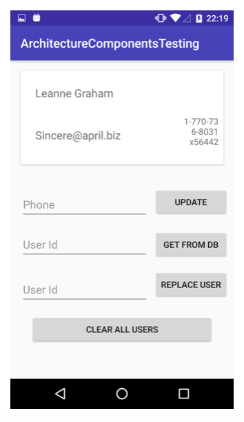
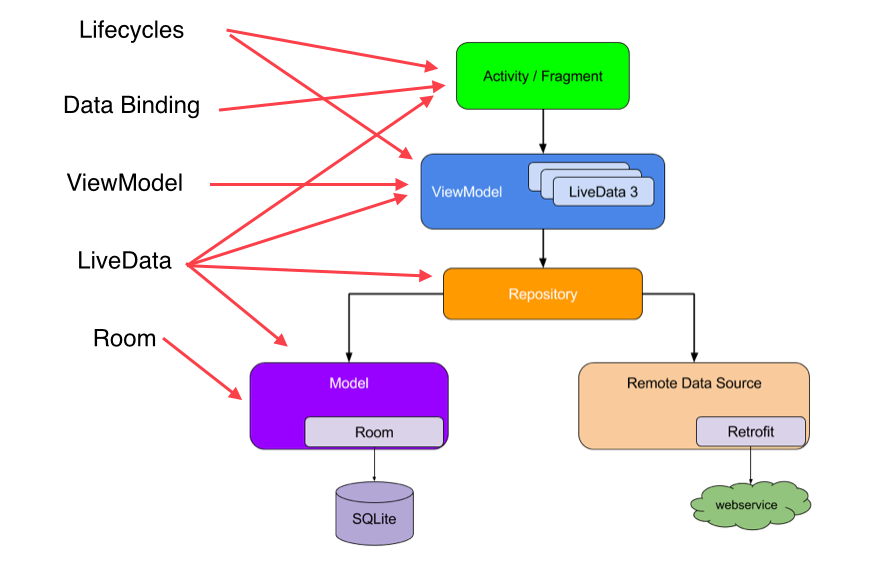

# Architecture Components Testing Example

The main focus of this codebase is to show examples of automated tests using 
Architecture components. This repository provides an example with MVVM. 
All layers in the architecture are covered by automated tests.
   
The idea of the repository is to use less dependencies as possible, so I did 
not use RxJava or Dagger intentionally.

## App

The user can do 4 operations in the app:
* Fetch an user from a remote server and store in the database
* Fetch an user stored on the database
* Change the user's phone just on the database
* Clear all users from the database

I used [jsonplaceholder](https://jsonplaceholder.typicode.com/) to provide me a fake REST API.

## Libraries used
* Data Binding
* ViewModel
* LiveData
* Room
* Lifecycle

## Improvements
We have a lot to improve in this repository. Things like managing view state with
single stream of data and other major refactor.